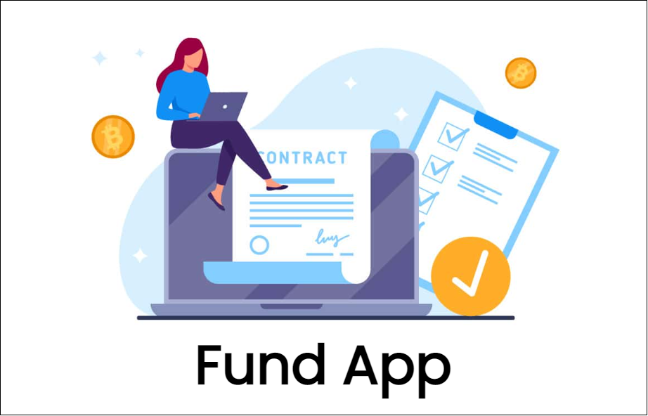
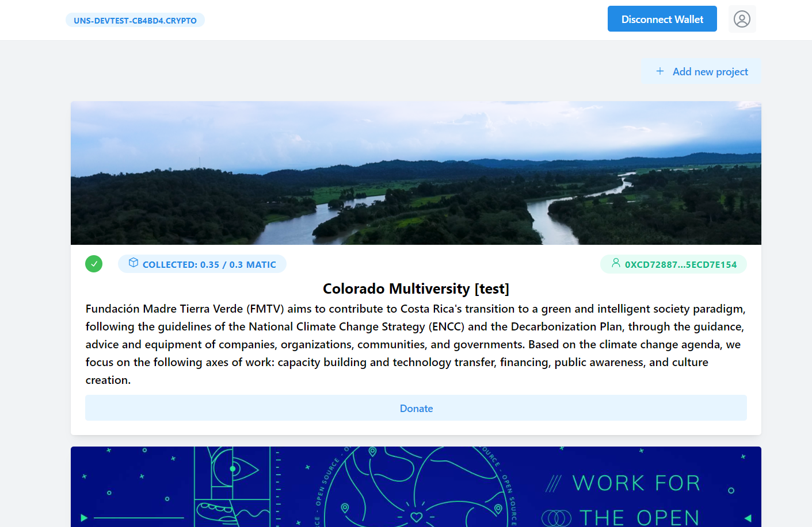

# FundApp

### Project description:

<i>A fundraising platform on the Polygon network, which provides an ecosystem for nonprofits and charities to create a fundraising campaign by providing a name, description, the desired amount to raise and other information.</i>

------

### Project demo:

- Live demo at [https://fundapp-denver.netlify.app](https://fundapp-denver.netlify.app)
- Video link: 

-------

### Built with:

- [Pocket Network](https://www.pokt.network/) - a multi-chain relay protocol that incentivizes RPC nodes to provide DApps and their users with unstoppable Web3 access. Was used a Pocket-powered RPC endpoint (Polygon Mainnet) 
- [Login with Unstoppable Domains](https://unstoppabledomains.com/)
- React & Mantine UI
- IPFS
- Solidity (smart contract)

---------

### Installation

Installing this project to use on your machine is simple. First,

`git clone https://github.com/oculusvision2/FundApp.git`

the repository. Next, navigate to the cloned directory

`cd FundApp`

and install the necessary Node.js modules with

`npm install`

Finally, to open the web app,

`npm run start`

You need to have Metamask Wallet. Connect to the app using your wallet. When connected, your address will show on the top navigation bar.

------------

### Preview

